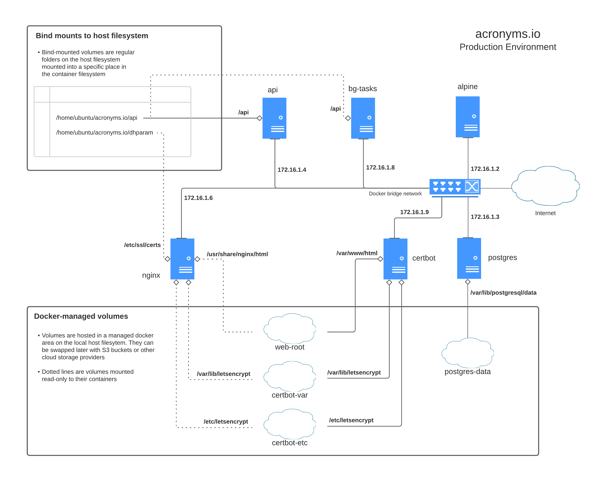

# acronyms.io

This is a basic web game I wrote to experiment with micro-service architecture using [Docker](https://docs.docker.com/compose/) and to get some experience with React and Redux on the client side, in particular with properly normalizing the client-side data store using Redux Toolkit's [entity adapters](https://redux-toolkit.js.org/api/createEntityAdapter).

The gameplay loop is simple:

* all players gathered in a room see the same random jumble of letters
* each player types a sentence or phrase whose words start with those letters
* after a minute or so the round ends
* players see everyone's phrases and can vote on which they like the best

Architecture of the production environment currently deployed at [acronyms.io](https://acronyms.io):

